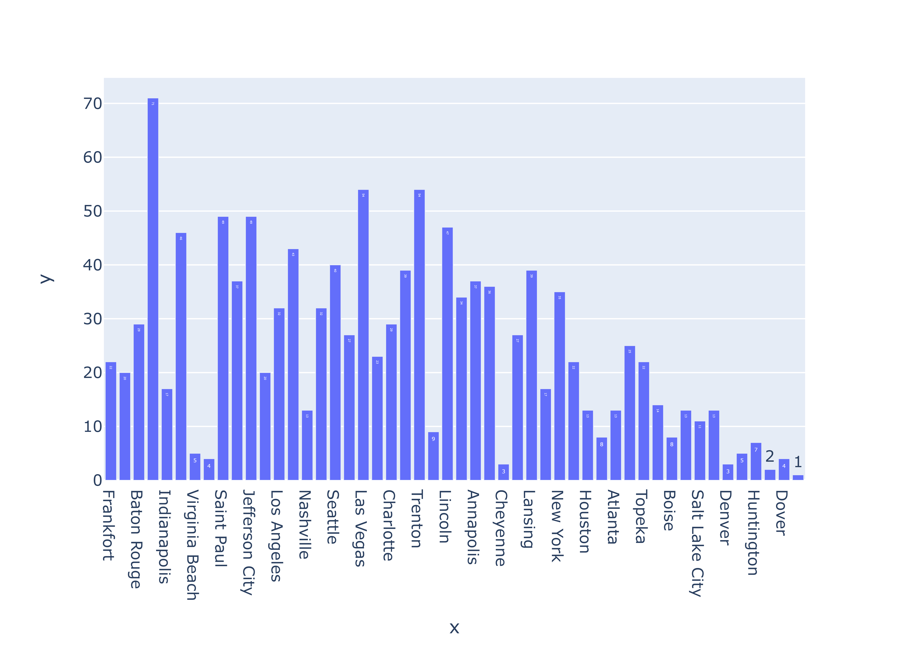

# Meeting 1

* Poor distribution of employees, e.g 8 in Miami which has a population of ~400k
and 54 employees in Lansing with a population of ~90k.
* Extreme understaffed: 
  * Juneau - 2 -> 31k
  * Dover - 4 -> 39k
  * Little Rock - 1 -> 201k

